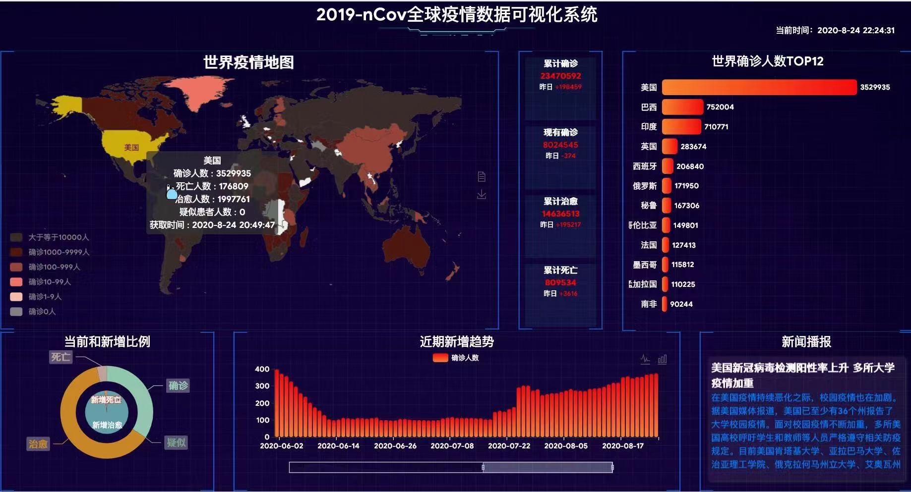

# ncov2019

> 该系统是以数据可视化为核心，Vue.js为底层框架，echarts为可视化开发工具，ajax为请求接口技术，最终开发出的疫情数据可视化大屏系统，大屏操作友好且数据实时全面，让人们能更直观的了解全球疫情的发展情况，助力全球抗疫。开发本系统使用接口均是丁香园和清华数据库团队收集的来自世界卫生组织（WHO）和全国各地卫健委的数据，保证了数据的全面性和准确性。 

## Build Setup

``` bash
# install dependencies
npm install

# serve with hot reload at localhost:8080
npm run dev

# build for production with minification
npm run build

# build for production and view the bundle analyzer report
npm run build --report
```
## 效果展示

注：点击地图中中国区域可以跳转中国地图，刷新为中国数据；新闻播报点击也可以直接跳转新闻详情。

For a detailed explanation on how things work, check out the [guide](http://vuejs-templates.github.io/webpack/) and [docs for vue-loader](http://vuejs.github.io/vue-loader).


